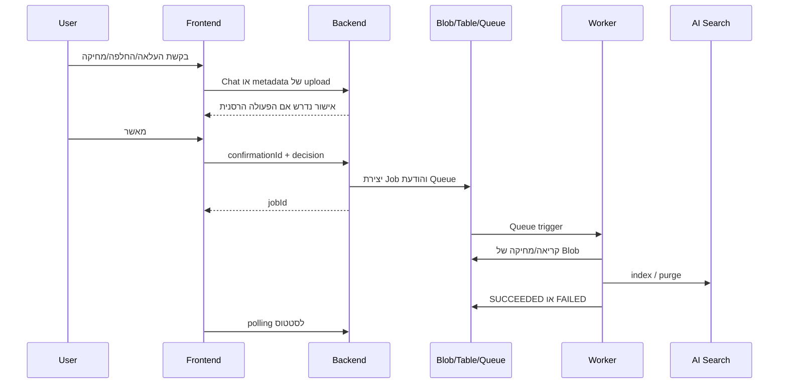

# Architecture

מסמך זה מתאר את המימוש הפעיל נכון ל-16 בספטמבר 2026.

## רכיבים

| שכבה | שירות | אחריות |
|---|---|---|
| UI | React/Vite ב-Azure Static Web Apps | צ'אט, העלאה, אישורים, מקורות ומעקב עבודות |
| API | FastAPI ב-Azure Container Apps | אימות, שיחה, הפעלת כלים, RAG ושמירת היסטוריה |
| Agent | Azure OpenAI `gpt-5-mini` | בחירת כלי וניסוח תשובה מבוססת מקורות |
| Retrieval | Azure AI Search | BM25, וקטורים, Semantic Ranker וסינון לפי מסמך |
| Source of truth | Azure Blob Storage | ספריית PDF פעילה; תחליף זמני ל-SharePoint |
| Ingestion | Azure Functions | עיבוד הודעות Queue וסנכרון האינדקס |
| Extraction | Azure AI Document Intelligence | חילוץ layout וטקסט מעמודי PDF |
| State | Queue + Table Storage | עבודות, אישורים, שיחות וקובץ פעיל בשיחה |
| Identity | Entra ID + Managed Identity | אימות משתמש והרשאות בין שירותים ללא סודות בקוד |
| Telemetry | Application Insights + Log Analytics | לוגים, תקלות ו-correlation IDs |

## קריאה ושאלות

1. ה-frontend שולח JWT והודעה ל-`POST /api/chat/message`.
2. ה-backend טוען את היסטוריית השיחה ואת המסמך הפעיל.
3. הסוכן מפעיל `search_documents` או `list_documents` לפי הצורך.
4. החיפוש משלב טקסט, embedding ו-Semantic Ranker. כשידוע שם המסמך נוסף filter.
5. שכבת evidence review מסווגת את התוצאות כ-`clear`, `ambiguous` או `insufficient`.
6. בתוצאה ברורה נשלחת תשובה ישירה עם מקורות. בעמימות מוצגות האפשרויות והמקורות למשתמש. בחוסר ראיות המערכת נמנעת מניחוש.
7. אירועי SSE מזרים טקסט, citations, בקשת אישור, job IDs וסיום.

שמירת המסמך הפעיל פותרת שאלות המשך כגון "הצג את שאלה א'" אחרי שאלה קודמת על אותו מבחן. החיפוש הרחב עדיין זמין כאשר אין מסמך פעיל או כשהמשתמש מבקש לחפש בכל הספרייה.

## העלאה, החלפה ומחיקה

- העלאה חדשה נשמרת ומאונדקסת ברקע.
- שם שכבר קיים הופך לזרימת החלפה ודורש אישור.
- מחיקה מפורשת מזוהה באופן דטרמיניסטי לפני פנייה למודל. התאמה חלקית מתקבלת רק כאשר יש מועמד יחיד ברור; אחרת המשתמש בוחר.
- `confirmationId` נתבע אטומית כדי למנוע הפעלה כפולה.
- המחיקה מסירה גם את ה-Blob וגם את כל ה-chunks של אותו `parentDocumentId`.

## אינדוקס

ה-Worker יוצר ומתחזק index, datasource, skillset ו-indexer. Document Intelligence מחלץ טקסט לפי layout; הטקסט נחלק למקטעים, וכל מקטע מקבל embedding של 1536 ממדים. המטא-דאטה כולל `chunkId`, `parentDocumentId`, `fileName`, `content`, `page`, `sourceUrl` ו-`text_vector`.

ה-indexer הוא משאב משותף ולכן ה-Worker מסדר הפעלות וממתין לסיום אמיתי. הוא בודק גם failures ברמת הפריט; הצלחת קריאת API בלבד אינה נחשבת הצלחת עבודה.

## בחירות תכנון

| בחירה | הסיבה |
|---|---|
| Container Apps ל-API | מתאים ל-FastAPI ול-SSE, container קבוע ו-scale מנוהל |
| Functions ל-Worker | Queue trigger טבעי ותשלום לפי שימוש |
| Storage Queue | תור זול ופשוט לעבודה אסינכרונית; הפעולות idempotent |
| Table Storage | state קטן לפי מפתחות, ללא צורך במסד רלציוני |
| AI Search | חיפוש היברידי, semantic ranking ואינטגרציה עם Azure OpenAI |
| Blob במקום SharePoint כרגע | מאפשר מערכת מלאה וממשק החלפה ברור; Graph ו-ACL trimming טרם נוספו |
| אישור בצד השרת | מונע מה-LLM או מהלקוח לבצע מחיקה ללא החלטת משתמש תקפה |

## אבטחה ובידוד

- ה-backend מאמת issuer, audience, scope וחתימה מול JWKS של Entra ID.
- היסטוריית שיחה נבדקת מול בעל השיחה; `conversationId` לבדו אינו מעניק גישה.
- Managed Identities ו-RBAC משמשים לגישה ל-Azure.
- הוראות מתוך PDF מטופלות כנתונים ולא כהוראות מערכת.
- פעולות הרסניות מחייבות אישור קצר-חיים, חד-פעמי ומקושר למשתמש ולקובץ.

## קנה מידה ועלות

לתרחיש קטן של אלפי PDF ומאות שיחות ביום, רכיב העלות הקבוע העיקרי הוא Azure AI Search; האחסון, Queue/Table וה-Functions זולים יחסית, ועלות OpenAI תלויה בכמות הטוקנים. בקנה מידה גדול, צווארי הבקבוק הראשונים צפויים להיות קיבולת/קצב האינדקס, מגבלות TPM של OpenAI וה-indexer המשותף. מעבר למספר partitions, קיבולת מודל גבוהה יותר ותזמון ingestion מפוצל יהיה נדרש לפני גידול של פי 100.

ראו [LIMITATIONS.md](LIMITATIONS.md) לפרטים על הפערים שנותרו.
