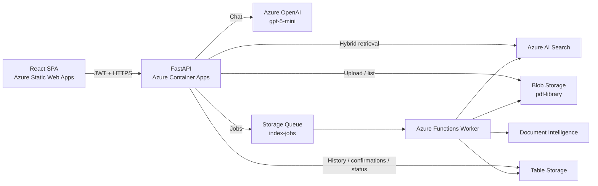

# SharePoint RAG & Agent Platform

מערכת צ'אט למסמכי PDF, עם חיפוש RAG, מקורות ברמת עמוד, העלאה/החלפה/מחיקה בשפה טבעית ועבודות רקע אסינכרוניות ב-Azure.

> מצב נכון ל-16 בספטמבר 2026: המערכת ממומשת, נבדקה מקומית ונפרסה לסביבת `dev`. בסביבה הנוכחית Azure Blob Storage משמש כספריית המסמכים. חיבור ישיר ל-SharePoint/Graph נשאר שלב עתידי.

## מה המערכת יודעת לעשות

- כניסה באמצעות Microsoft Entra ID.
- העלאת PDF, כולל העלאה בבלוקים לקבצים גדולים.
- אינדוקס ברקע באמצעות Azure Functions, Document Intelligence ו-Azure AI Search.
- חיפוש היברידי: מילות מפתח, וקטורים ו-Semantic Ranker.
- תשובות זורמות (SSE) עם שם מסמך, עמוד וקישור למקור.
- חסימת שאלות ידע כללי: תשובות עובדתיות נשלחות רק לאחר חיפוש שמצא ראיות במסמכים.
- שמירת הקשר של מסמך בין שאלות המשך.
- בדיקת ראיות לפני תשובה: תשובה ברורה, הצגת כמה אפשרויות במקרה של עמימות, או הודעה שאין מספיק מידע.
- רשימת מסמכים, החלפת מסמך ומחיקתו מתוך הצ'אט.
- אישור מפורש לפני פעולה הרסנית, עם התאמה לשם הקובץ הקנוני ב-Blob Storage.
- מעקב אחר עבודות `QUEUED`, `RUNNING`, `SUCCEEDED` ו-`FAILED`.

## ארכיטקטורה



זרימת כתיבה היא אסינכרונית: ה-API יוצר עבודה ומחזיר מיד; ה-Worker קורא את ה-PDF, מעדכן את האינדקס ורק אז מסמן את העבודה כהצלחה. מחיקה והחלפה מחייבות אישור משתמש לפני יצירת העבודה.

פירוט נוסף נמצא ב-[ARCHITECTURE.md](ARCHITECTURE.md). מגבלות ידועות נמצאות ב-[LIMITATIONS.md](LIMITATIONS.md).

## מצב הרכיבים

| רכיב | מצב |
|---|---|
| תשתית Bicep | פרוסה ב-`rg-sharepoint-rag-dev` |
| Backend FastAPI | ממומש ופרוס ב-Azure Container Apps |
| Worker | ממומש ופרוס ב-Azure Functions |
| Frontend React | ממומש ופרוס ב-Azure Static Web Apps |
| אימות והרשאות | Entra ID + Managed Identities/RBAC |
| CI/CD | workflows נפרדים לתשתית, backend, worker ו-frontend |
| בדיקות backend | 143 בדיקות עוברות בבדיקה האחרונה |

כתובות סביבת `dev`:

- Frontend: `https://delightful-river-0f09b360f.5.azurestaticapps.net`
- Backend: `https://ca-backend-ragpoc-dev-qelri355pi.redrock-32afe15c.swedencentral.azurecontainerapps.io`
- Repository: `https://github.com/dudibibla/lab-for-tecktika.git`

## שירותים והגדרות עיקריות

| שימוש | הגדרה נוכחית |
|---|---|
| מודל שיחה | `gpt-5-mini` |
| Embeddings | `text-embedding-3-small` (1536 ממדים) |
| OpenAI API version | `2025-04-01-preview` |
| Search index | `pdf-chunks-index` |
| Semantic configuration | `document-content-semantic` |
| Blob container | `pdf-library` |
| Queue | `index-jobs` |
| Job table | `jobstatus` |

## מבנה המאגר

| נתיב | תוכן |
|---|---|
| `infrastructure/` | Bicep וסקריפטים להקמת Azure ו-Entra ID |
| `backend/` | FastAPI, סוכן, RAG, אישורים, היסטוריה וניהול עבודות |
| `worker/` | Queue Trigger, Document Intelligence וניהול Azure AI Search |
| `frontend/` | React/Vite, MSAL, צ'אט, העלאה, אישורים ומעקב עבודות |
| `docs/` | דרישות המקור ותיעוד המעבר ל-Document Intelligence |

## הרצה מקומית

דרישות: Python 3.11, Node.js 20, Azure CLI, Azure Functions Core Tools והרשאות למשאבי Azure המתאימים. העתיקו את קובצי ה-`.env.example` והשלימו ערכים מקומיים; אין להכניס סודות ל-Git.

Backend:

```powershell
cd backend
python -m venv .venv
.\.venv\Scripts\Activate.ps1
pip install -r requirements.txt
uvicorn app.main:app --reload --port 8000
```

Frontend:

```powershell
cd frontend
npm ci
npm run dev
```

Worker:

```powershell
cd worker
python -m venv .venv
.\.venv\Scripts\Activate.ps1
pip install -r requirements.txt
func start
```

## בדיקות

```powershell
cd backend
python -m pytest tests -q

cd ..\worker
python -m pytest tests -q

cd ..\frontend
npm ci
npm run lint
npm test
npm run build
```

## פריסה

Push ל-`main` מפעיל workflow לפי הנתיבים שהשתנו:

- `.github/workflows/deploy-infra.yml` — תשתית Bicep דרך OIDC.
- `.github/workflows/ci-backend.yml` — בדיקות, image ב-GHCR ועדכון Container App.
- `.github/workflows/ci-worker.yml` — בדיקות, vendoring בתוך image תואם Azure Functions ופריסה.
- `.github/workflows/ci-frontend.yml` — lint, בדיקות, build ופריסה ל-Static Web Apps.

הערות תפעול חשובות:

- פריסת תשתית משמרת את `WEBSITE_RUN_FROM_PACKAGE`; מחיקתו משביתה את ה-Worker.
- ל-Container App נדרש credential מפורש ל-GHCR גם אם החבילה נראית ציבורית.
- משתני Entra ריקים אינם אמורים לדרוס את הגדרות האימות הקיימות.
- `SUCCEEDED` פירושו שהאינדקס סיים והמסמך זמין לחיפוש, או שהמחיקה הושלמה.

## מסמכי פרויקט

- [ARCHITECTURE.md](ARCHITECTURE.md) — המבנה הנוכחי והחלטות התכנון.
- [SUMMARY.md](SUMMARY.md) — סיכום התפתחות, תקלות ופתרונות.
- [LIMITATIONS.md](LIMITATIONS.md) — מגבלות וסיכונים שנותרו.
- [frontend/API.md](frontend/API.md) — חוזה ה-API בין ה-frontend ל-backend.
- [docs/EXERCISE_REQUIREMENTS.md](docs/EXERCISE_REQUIREMENTS.md) — דרישות המטלה המקוריות.
- [docs/LEARNING_GUIDE_HE.md](docs/LEARNING_GUIDE_HE.md) — מדריך Reverse Engineering ופרומפט ללימוד הפרויקט.
- `plan.md`, `backend_plan.md`, `backend_context.md` — מסמכי תכנון היסטוריים, לא מקור למצב הנוכחי.
