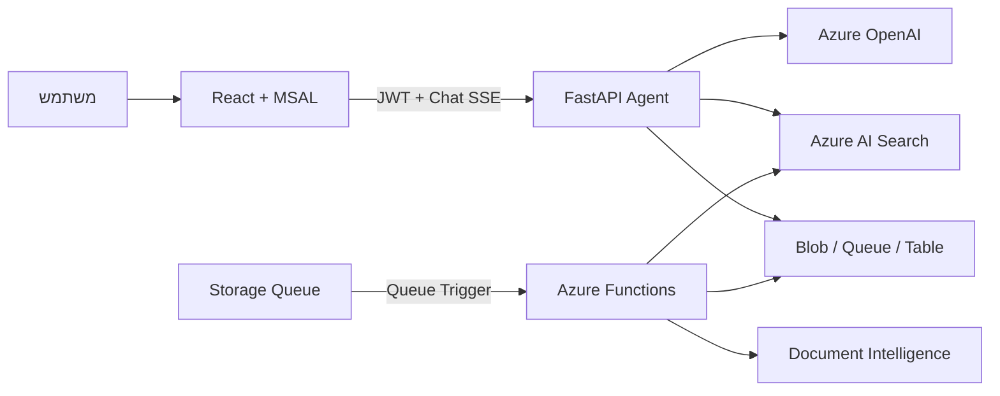

# מדריך Reverse Engineering ללימוד המערכת

המטרה של המסמך היא לעזור למפתח ללמוד את הפרויקט מתוך הקוד: להבין מה נבנה, למה התקבלו ההחלטות, כיצד המידע זורם, אילו תקלות התגלו ואיך מאמתים שהמערכת עובדת.

## איך להשתמש במדריך עם GPT

כדי שהמודל ילמד את הפרויקט האמיתי ולא ינחש, יש לתת לו גישה לקוד. אפשר:

1. לפתוח שיחה שמחוברת למאגר GitHub.
2. להעלות ZIP של המאגר ללא `.env`, מפתחות, tokens, תיקיות `.venv` או `node_modules`.
3. אם אי אפשר להעלות את כל המאגר, לצרף תחילה את הקבצים הבאים:
   - `README.md`
   - `ARCHITECTURE.md`
   - `SUMMARY.md`
   - `LIMITATIONS.md`
   - `fix_bugs.md`
   - `infrastructure/main.bicep`
   - `backend/app/main.py`
   - `backend/app/api/v1/endpoints/chat.py`
   - `backend/app/agent/runner.py`
   - `backend/app/agent/prompts.py`
   - `backend/app/agent/tools/search_tool.py`
   - `backend/app/services/evidence_service.py`
   - `backend/app/services/job_manager.py`
   - `worker/function_app.py`
   - `worker/services/search_indexer.py`
   - `frontend/src/hooks/useChat.ts`
   - `frontend/src/services/chat.ts`
   - קובצי ה-workflow תחת `.github/workflows/`

## פרומפט מאסטר להעתקה

העתק את הטקסט הבא לשיחה חדשה עם GPT לאחר שחיברת את המאגר או העלית את הקבצים:

---

אתה המורה הטכני שלי. לפניך קוד של מערכת Azure RAG לניהול ותחקור מסמכי PDF. אני רוצה לבצע Reverse Engineering וללמוד את המערכת לעומק מתוך הקוד הקיים.

כללי עבודה:

1. קרא קודם את `README.md`, `ARCHITECTURE.md`, `SUMMARY.md`, `LIMITATIONS.md`, `fix_bugs.md` ו-`RULES.md`.
2. לאחר מכן בדוק את הקוד עצמו. אל תניח שהתיעוד נכון כאשר הקוד אומר אחרת.
3. בכל הסבר ציין את הנתיב לקובץ ואת הפונקציה או המחלקה שעליה אתה מסתמך.
4. הפרד בין:
   - מה שקיים ועובד בקוד;
   - מה שקיים רק בתיעוד;
   - מה שהוא מגבלה או עבודה עתידית.
5. אל תיתן לי את כל החומר בבת אחת. למד אותי בפרקים, ובסוף כל פרק:
   - שאל אותי 3 שאלות קצרות;
   - תן לי משימת חקירה אחת בקוד;
   - המתן לתשובות שלי;
   - בדוק את תשובותיי והסבר טעויות לפני מעבר לפרק הבא.
6. הסבר תחילה בשפה פשוטה, ואחר כך הוסף את הפרטים הטכניים.
7. כשאתה מציג זרימה, השתמש בתרשים Mermaid ובדוגמה ממשית.
8. כשאתה מתאר תקלה, הסבר:
   - מה המשתמש ראה;
   - מה היה הגורם בקוד או בענן;
   - כיצד אבחנו אותו;
   - מה שונה;
   - איזו בדיקה מונעת חזרה של התקלה.
9. אל תמציא שירותים, endpoints, שמות משאבים או התנהגות שאינם מופיעים בקוד.
10. אם חסר לך קובץ, עצור ובקש ממני את הנתיב המדויק במקום לנחש.

למד אותי לפי הסדר הבא:

### פרק 1 — תמונת המערכת

- איזו בעיה המוצר פותר.
- מה תפקיד ה-Frontend, ה-Backend, ה-Worker וה-Infrastructure.
- מדוע Blob Storage משמש כרגע במקום SharePoint.
- ההבדל בין Source of Truth לבין Azure AI Search.

### פרק 2 — זרימת שאלה ותשובה

עקוב בקוד אחרי הודעה שנשלחת מהדפדפן ועד להצגת התשובה:

- MSAL ו-JWT;
- `POST /api/chat/message`;
- SSE;
- Agent runner;
- בחירת כלי;
- חיפוש היברידי;
- Evidence adjudication;
- citations והיסטוריית שיחה.

הסבר גם את ההגנה שמונעת תשובות ידע כללי ללא ראיות מהמסמכים.

### פרק 3 — זרימת העלאה ואינדוקס

עקוב אחרי PDF מהרגע שהוא נבחר בדפדפן ועד שהוא ניתן לחיפוש:

- staging/upload;
- יצירת Job;
- Table Storage;
- הודעה ל-`index-jobs`;
- Azure Storage Queue Trigger;
- Azure Functions Worker;
- Document Intelligence;
- chunking;
- embeddings;
- Azure AI Search indexer;
- מעבר בין `QUEUED`, `RUNNING`, `SUCCEEDED` ו-`FAILED`.

### פרק 4 — החלפה ומחיקה

- מדוע הפעולה דורשת אישור.
- כיצד `confirmationId` מונע ביצוע כפול.
- כיצד שם עברי חלקי נפתר לשם Blob קנוני.
- מדוע מחיקה מפורשת עוקפת את המודל.
- כיצד נמחקים ה-Blob וה-chunks באינדקס.

### פרק 5 — שאלות המשך ואיכות RAG

- כיצד נשמר active document.
- מדוע “הצג את שאלה א'” נכשל בעבר.
- Semantic Ranker לעומת vector search ו-BM25.
- ההבדל בין `clear`, `ambiguous` ו-`insufficient`.
- מתי המערכת מציגה כמה אפשרויות במקום לבחור.

### פרק 6 — Azure ואבטחה

- Entra ID ו-JWT.
- Managed Identity ו-RBAC.
- GitHub OIDC.
- secrets לעומת מזהים ציבוריים.
- CORS.
- הגנה מפני prompt injection.
- גבול האמון בין המשתמש, תוכן PDF, המודל והכלים.

### פרק 7 — CI/CD והתקלות בענן

- ארבעת ה-workflows.
- GHCR ו-Container Apps.
- vendoring של dependencies ל-Azure Functions.
- בעיית glibc.
- `WEBSITE_RUN_FROM_PACKAGE`.
- מעבר המאגר והחלפת namespace.
- כיצד בודקים revision ו-health לאחר פריסה.

### פרק 8 — בדיקות ומגבלות

- מה בדיקות היחידה באמת מוכיחות.
- מה הן אינן מוכיחות לגבי איכות התשובות.
- כיצד לבנות evaluation set בעברית.
- SharePoint/Graph ו-ACL trimming שעדיין חסרים.
- צווארי בקבוק אפשריים בעומס.

התחל עכשיו רק בפרק 1. לפני ההסבר, הצג רשימה קצרה של הקבצים שבדקת בפועל.

---

## מפת המערכת בקצרה

חשוב להבין שיש שתי זרימות שונות:

- **קריאה:** שאלה → Backend → חיפוש → בדיקת ראיות → תשובה ומקורות.
- **כתיבה:** העלאה/החלפה/מחיקה → Job בתור → Worker → Blob ואינדקס → סטטוס.

## תרגיל Reverse Engineering ראשון

נסה לענות מתוך הקוד בלבד:

1. איזה endpoint מקבל הודעת צ'אט?
2. היכן ה-Backend מחליט איזה כלי הסוכן רשאי להפעיל?
3. איזו פונקציה מונעת תשובה עובדתית ללא ראיה מהמסמכים?
4. מי שולח הודעה ל-`index-jobs`?
5. מה גורם ל-Worker להתחיל לעבוד?
6. באיזה שלב Job הופך ל-`SUCCEEDED`?

אל תחפש את התשובות במסמך זה. פתח את הקוד ועקוב אחרי הקריאות.

## שאלות שכדאי לשאול בכל רכיב

כאשר חוקרים קובץ או שירות, שאל:

- מה נכנס אליו?
- מה יוצא ממנו?
- מי קורא לו?
- באיזה state הוא נוגע?
- מה קורה כשהוא נכשל?
- האם הפעולה idempotent?
- מהו גבול האמון?
- איזו בדיקה מכסה אותו?
- כיצד רואים את התקלה ב-Azure?

## הצעה לתרגול מעשי

בצע כל תרגיל בענף נפרד ואל תפרוס לפני שהבדיקות עוברות:

1. הוסף הודעת scope שונה ובדוק ש-`כמה זה שורש 2?` עדיין נחסם.
2. הוסף שאלה ומסמך ל-evaluation קטן ובדוק retrieval, תשובה ו-citation בנפרד.
3. עקוב אחרי Job אמיתי לפי `jobId` ב-Table Storage ובלוגים.
4. שנה test כך שייכשל, הסבר מה הוא מגן עליו והחזר אותו למצב תקין.
5. צייר בעצמך sequence diagram למחיקה והשווה ל-`ARCHITECTURE.md`.

## מקורות האמת במאגר

- `README.md` — הפעלה ומצב נוכחי.
- `ARCHITECTURE.md` — מבנה וזרימות.
- `SUMMARY.md` — התפתחות ותקלות.
- `LIMITATIONS.md` — פערים שנותרו.
- `fix_bugs.md` — תקלות, סיבות ופתרונות.
- הקוד והבדיקות — מקור האמת הסופי להתנהגות.

`plan.md`, `backend_plan.md` ו-`backend_context.md` הם מסמכים היסטוריים. הם שימושיים כדי להבין כיצד חשבנו בתחילת הדרך, אך אינם מתארים את המצב הנוכחי.
